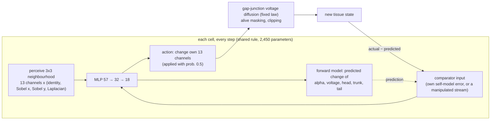

# Morpheus

**Does a body know itself? Synthetic tissues that grow from one cell, carry a self-model in every cell, keep a memory in their membrane voltage, and try to improve their own rules while an auditor checks whether they are fooling themselves.**

Author/project lead: **Kai Piper** · Version **0.1.0** · 28 September 2026

> **Scientific status.** Everything here is a synthetic computational experiment on a neural cellular automaton. "Self-model" names a trained forward model inside each simulated cell. Nothing here detects or implies sentience, consciousness or biological validity.

Morpheus puts three lines of research that normally stay apart into one preregistered laboratory:

1. **Morphogenesis as collective computation.** A neural cellular automaton grows a planarian-like body (head, trunk, tail) from a single founder cell and regrows it after amputation ([Mordvintsev et al. 2020](https://distill.pub/2020/growing-ca/)).
2. **Bioelectric pattern memory.** Every cell has a membrane voltage coupled to its neighbours through gap junctions. Morpheus runs Levin-style interventions on it: a gap-junction block (the octanol experiment), a voltage clamp after amputation, and a second amputation to see whether a rewritten pattern persists ([Levin 2021](https://doi.org/10.1016/j.cell.2021.02.034); [Durant et al. 2017](https://doi.org/10.1016/j.bpj.2017.04.011); [Pezzulo & Levin 2016](https://doi.org/10.1098/rsif.2016.0555)).
3. **Self-models and authorship.** Every cell predicts how its own visible state will change, given that it acted (an efference copy / forward model; [Wolpert, Ghahramani & Jordan 1995](https://doi.org/10.1126/science.7569931)). Its prediction error is fed back as input. Morpheus asks whether a regenerating tissue does better with **its own** error than with an error stream **transplanted** from another tissue. This is the paradigm from [GhostInTheMachine](https://github.com/kai9987kai/GhostInTheMachine), moved from an abstract network into a body.

The tissues then **try to improve themselves**. They propose edits to their own rule, by practising with their own learning algorithm, by random mutation, or by editing their own physics. A naive loop adopts whatever beats a reused benchmark. An audited loop tests each edit on fresh tissues under **online false-discovery-rate control** (LORD++; [Ramdas et al. 2017](https://arxiv.org/abs/1710.00499)) with a frozen anti-forgetting anchor. An auditor the loops never see measures what each loop *actually* gained, so the difference between what a loop believes and what is true measures its **self-deception**.

<!-- results-summary -->

## Built from six earlier projects

| Earlier project | What Morpheus takes from it |
|---|---|
| [GenesisEngine](https://github.com/kai9987kai/GenesisEngine) | development from a single cell, a deterministic seeded core that is separate from the renderer, paired seeds per intervention |
| [GhostInTheMachine](https://github.com/kai9987kai/GhostInTheMachine) | the authorship paradigm (own vs transplanted vs delayed error streams, and whether an error is predictable from the receiver's own state), preregistration, null calibration, and a claims ledger checked in CI |
| [Supermix Expanse](https://github.com/kai9987kai/Supermix-expanse) / [v2](https://github.com/kai9987kai/Supermix-Expanse-v2) | fixed wiring with learned dynamics: the gap-junction physics is a fixed law, as the connectome wiring is in Expanse, and only the cell rule learns. Zero-initialised action heads, like Expanse's zero-gated grafts. A frozen anchor suite as the anti-forgetting teacher |
| [RSI-Laboratory](https://github.com/kai9987kai/RSI-Laboratory) | the recursive self-improvement loop, here made auditable: every self-edit is a hypothesis test with an error budget |
| [Reflect Cognitive Studio](https://github.com/kai9987kai/Reflect-Cognitive-Studio) | transparent internals in a local-first, single-file browser lab. Voltage, self-model error and the evidence ledger are all visible and can be manipulated |

## What is new here

To my knowledge, none of these has been done before:

* **Authorship tested causally inside a regenerating body.** Error streams are transplanted between tissues cell for cell, so the input statistics match and only ownership differs. Delayed and spatially shuffled controls, and the Ghost-v7 question of whether the error is predictable from the receiver's own state, go with it.
* **Levin-style bioelectric experiments preregistered on an evolved synthetic tissue**, including the re-amputation persistence test for a rewritten target morphology.
* **Recursive self-improvement audited for self-deception.** Online FDR control over an unbounded stream of self-modifications, and an independent held-out auditor that turns "how much is this system fooling itself?" into a number.
* **One engine in two languages.** The Python (NumPy) engine used for science and the JavaScript engine in the browser lab are tested step for step against each other. The trainer is exact backpropagation through time written by hand in NumPy and checked against finite differences, with no deep-learning framework.

## How it works



**Life cycle.** Each tissue grows for 64 steps from one founder cell. It then gets a wound (head amputation, tail amputation, a disc, or a lateral cut) and regenerates for 48 steps. Every experimental condition reuses the same founders, wounds and asynchronous-update noise, so the effect of a manipulation is measured within each tissue.

**Training.** Exact backpropagation through time over the whole 112-step life (`src/morpheus/grad.py`). The objective is anatomical error at the end of growth and of regeneration, plus a small weight on the self-model's own prediction error. A quarter of training tissues have their comparator silenced, so the "zero" ablation is not out of distribution.

## Results

<!-- claims:start (generated by `morpheus claims render`; edit claims/claims.json) -->
<!-- claims:end -->

## Quick start

```bash
python -m pip install -e ".[test]"
morpheus show --wound head_amputation          # ASCII: target, grown, wounded, regenerated
python -m pytest -q                            # gradient check, JS/Python parity, statistics
morpheus claims check                          # every quoted number against the results files
```

Open **`web/index.html`** in a browser for the interactive lab: cut the tissue with a scalpel, paint voltage, block gap junctions, silence or delay the self-model, and see the evidence panels. It needs no server or build step. `morpheus export-web` refreshes `web/data.js` from the current weights and results.

Reproduce everything (about 2 hours on a 4-core laptop CPU):

```bash
morpheus train --seed 0 --out weights/rule_a.json          # ~35 min
morpheus train --seed 1 --out weights/rule_b.json          # replication rule
morpheus run all --weights weights/rule_a.json --out results/rule_a.json
morpheus run all --weights weights/rule_b.json --out results/rule_b.json
morpheus run rsi --weights weights/rule_a.json --out results/rsi.json
morpheus export-web
```

## Repository map

| Path | What |
|---|---|
| `src/morpheus/tissue.py` | the cell rule, perception, gap-junction physics, self-model error |
| `src/morpheus/life.py` | growth, wounds, regeneration, comparator conditions, interventions |
| `src/morpheus/grad.py` | hand-written backpropagation through time (checked against finite differences) |
| `src/morpheus/experiments.py` | H1 to H3 and the null calibration |
| `src/morpheus/rsi.py` | naive and audited self-improvement loops, the auditor |
| `src/morpheus/stats.py` | paired bootstrap, sign-flip permutation tests, Holm, LORD++ |
| `src/morpheus/claims.py` | the claims ledger (`claims/claims.json`) checked against `results/` |
| `prereg/PREREGISTRATION.json` | hypotheses, sample sizes, seeds and decision rules, committed before any confirmatory run |
| `docs/DEVIATIONS.md` | every departure from the preregistration, with its reason |
| `web/` | the browser lab (`index.html`) and the JavaScript engine (`tissue.js`) |

## Limitations

* The unit of analysis is a tissue under one evolved rule. Rule B, trained with a different seed, is the only test of whether a result holds for other rules.
* The anatomy is 32×32 and the rule is small. The voltage channel is free (it has no target), so any bioelectric prepattern is the rule's own invention and may differ between rules.
* "Authorship" here is operational: whether the comparator input is the cell's own error, at the right time and place. It says nothing about experience.
* The self-improvement results depend on the proposer. With stronger proposers the balance between the loops' gains may change. The self-deception measure does not depend on the proposer.

## License

MIT, see [LICENSE](LICENSE).
