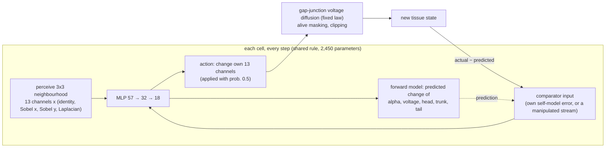

# Morpheus

**Does a body know itself? Synthetic tissues that grow from one cell, carry a self-model in every cell, keep a memory in their membrane voltage, and try to improve their own rules while an auditor checks whether they are fooling themselves.**

Author/project lead: **Kai Piper** · Version **0.2.0** · 28 September 2026

> **Scientific status.** Everything here is a synthetic computational experiment on a neural cellular automaton. "Self-model" names a trained forward model inside each simulated cell. Nothing here detects or implies sentience, consciousness or biological validity.

Morpheus puts three lines of research that normally stay apart into one preregistered laboratory:

1. **Morphogenesis as collective computation.** A neural cellular automaton grows a planarian-like body (head, trunk, tail) from a single founder cell and regrows it after amputation ([Mordvintsev et al. 2020](https://distill.pub/2020/growing-ca/)).
2. **Bioelectric pattern memory.** Every cell has a membrane voltage coupled to its neighbours through gap junctions. Morpheus runs Levin-style interventions on it: a gap-junction block (the octanol experiment), a voltage clamp after amputation, and a second amputation to see whether a rewritten pattern persists ([Levin 2021](https://doi.org/10.1016/j.cell.2021.02.034); [Durant et al. 2017](https://doi.org/10.1016/j.bpj.2017.04.011); [Pezzulo & Levin 2016](https://doi.org/10.1098/rsif.2016.0555)).
3. **Self-models and authorship.** Every cell predicts how its own visible state will change, given that it acted (an efference copy / forward model; [Wolpert, Ghahramani & Jordan 1995](https://doi.org/10.1126/science.7569931)). Its prediction error is fed back as input. Morpheus asks whether a regenerating tissue does better with **its own** error than with an error stream **transplanted** from another tissue. This is the paradigm from [GhostInTheMachine](https://github.com/kai9987kai/GhostInTheMachine), moved from an abstract network into a body.

The tissues then **try to improve themselves**. They propose edits to their own rule, by practising with their own learning algorithm, by random mutation, or by editing their own physics. A naive loop adopts whatever beats a reused benchmark. An audited loop tests each edit on fresh tissues under **online false-discovery-rate control** (LORD++; [Ramdas et al. 2017](https://arxiv.org/abs/1710.00499)) with a frozen anti-forgetting anchor. An auditor the loops never see measures what each loop *actually* gained, so the difference between what a loop believes and what is true measures its **self-deception**.

### New in v0.2: an anatomical compiler, and self-improvement that can actually improve

* **The anatomical compiler works, partly.** Morpheus can now *design* a bioelectric intervention. Gradient descent through the whole regeneration finds a voltage pattern that, clamped for 12 steps after a tail amputation, makes held-out stumps grow head tissue where the tail was. Holding the same voltages at scrambled positions works far less well, so the spatial code matters. This replicates across both rules. The change is also remembered: after a second amputation with no intervention, treated tissues still regrow more head posteriorly. It is partial, though. No tissue grew a clean second head, and the lasting memory in rule A is not specific to the code.
* **Bioelectric codes did not transfer between rules** (exploratory). Rule B's pattern applied to rule A reprograms it more than rule A's own design, and a shuffled version of it does even better. That means voltage *dose* dominated, and the compiler found a local optimum. Better compilers (multi-start, dose-aware) are the obvious next step.
* **Self-deception is real once there is something to gain.** Starting from an under-trained rule, naive self-improvement loops believed they gained about 2.6× what the auditor measured, significantly more than audited loops (p 0.005, 9 of 10 seeds). The audit has a price: the audited loop is timid. It adopted about one edit in every three loops and gained little, while the naive loop truly improved more even as it overstated its gains.
<!-- h1c-summary -->

v0.2 was preregistered in [`prereg/PREREGISTRATION_v2.json`](prereg/PREREGISTRATION_v2.json) before any confirmatory run, with the compiler pilots (training tissues only) disclosed there.

### What we found in v0.1 (two independently evolved rules, 128 tissues per test)

* **Voltage matters, causally.** Blocking gap junctions impairs regeneration in both rules. A 12-step voltage clamp right after a head amputation changes what regrows in every tissue of both rules. The two rules evolved **opposite voltage codes** (tail at +3.9 in one, −3.1 in the other). In rule A the clamp turns the regrowing head into trunk and tail; in rule B it damages the regrowth without changing head identity.
* **Memory of the clamp does not reliably persist.** In rule A the effect survived a second amputation with no clamp, in the spirit of Levin's permanently two-headed planaria. In rule B it did not. An exploratory dissection of rule A finds the lasting change spread across channels, with voltage carrying most of it.
* **Authorship is an open question.** In both rules a cell's own self-model error is about twice as predictable from its own state as a transplanted error (the GhostInTheMachine v7 pattern, reproduced in a body). Whether that helps regeneration differs between rules: no effect in the primary rule A, a small consistent benefit in rule B.
* **Self-improvement: the audited loop never fooled itself, because it never adopted anything.** Over 240 proposed self-edits, the online-FDR gate accepted none. The naive loops adopted 12, all edits to their own physics, and a third of those made held-out tissues worse. The naive loops believed they gained about twice what the auditor measured, but with 6 seeds that difference is not significant, so the preregistered H4 is **not supported**.
* The null calibration behaves (0/40 and 1/40 false positives at α = 0.05). Two deviations from the preregistration, both made before any confirmatory result was seen, are listed in [`docs/DEVIATIONS.md`](docs/DEVIATIONS.md).

Every number below is checked in CI against the results file it comes from (`morpheus claims check`).

## Built from six earlier projects

| Earlier project | What Morpheus takes from it |
|---|---|
| [GenesisEngine](https://github.com/kai9987kai/GenesisEngine) | development from a single cell, a deterministic seeded core that is separate from the renderer, paired seeds per intervention |
| [GhostInTheMachine](https://github.com/kai9987kai/GhostInTheMachine) | the authorship paradigm (own vs transplanted vs delayed error streams, and whether an error is predictable from the receiver's own state), preregistration, null calibration, and a claims ledger checked in CI |
| [Supermix Expanse](https://github.com/kai9987kai/Supermix-expanse) / [v2](https://github.com/kai9987kai/Supermix-Expanse-v2) | fixed wiring with learned dynamics: the gap-junction physics is a fixed law, as the connectome wiring is in Expanse, and only the cell rule learns. Zero-initialised action heads, like Expanse's zero-gated grafts. A frozen anchor suite as the anti-forgetting teacher |
| [RSI-Laboratory](https://github.com/kai9987kai/RSI-Laboratory) | the recursive self-improvement loop, here made auditable: every self-edit is a hypothesis test with an error budget |
| [Reflect Cognitive Studio](https://github.com/kai9987kai/Reflect-Cognitive-Studio) | transparent internals in a local-first, single-file browser lab. Voltage, self-model error and the evidence ledger are all visible and can be manipulated |

## What is new here

To my knowledge, none of these has been done before:

* **Authorship tested causally inside a regenerating body.** Error streams are transplanted between tissues cell for cell, so the input statistics match and only ownership differs. Delayed and spatially shuffled controls, and the Ghost-v7 question of whether the error is predictable from the receiver's own state, go with it.
* **Levin-style bioelectric experiments preregistered on an evolved synthetic tissue**, including the re-amputation persistence test for a rewritten target morphology.
* **An anatomical compiler**: exact gradients through a regenerating tissue used to design a spatial voltage code that reprograms what regrows, tested against the same voltages scrambled and for memory through re-amputation.
* **Recursive self-improvement audited for self-deception.** Online FDR control over an unbounded stream of self-modifications, and an independent held-out auditor that turns "how much is this system fooling itself?" into a number.
* **One engine in two languages.** The Python (NumPy) engine used for science and the JavaScript engine in the browser lab are tested step for step against each other. The trainer is exact backpropagation through time written by hand in NumPy and checked against finite differences, with no deep-learning framework.

## How it works



**Life cycle.** Each tissue grows for 64 steps from one founder cell. It then gets a wound (head amputation, tail amputation, a disc, or a lateral cut) and regenerates for 48 steps. Every experimental condition reuses the same founders, wounds and asynchronous-update noise, so the effect of a manipulation is measured within each tissue.

**Training.** Exact backpropagation through time over the whole 112-step life (`src/morpheus/grad.py`). The objective is anatomical error at the end of growth and of regeneration, plus a small weight on the self-model's own prediction error. Half of every batch is a *persistence* phase: old tissues from a pool are re-wounded and must hold or regrow the body for another 48 steps, which teaches anatomical homeostasis beyond one life. A quarter of training tissues have their comparator silenced, so the "zero" ablation is not out of distribution. 3000 iterations take about 40 minutes on 4 CPU cores.

## Results

<!-- claims:start (generated by `morpheus claims render`; edit claims/claims.json) -->

| claim | status | evidence |
|---|---|---|
| **Anatomical compiler: a voltage code designed by gradient descent makes tail stumps grow head tissue where the tail was** | **replicated** | posterior head index on 128 held-out tissues (−1 = normal tail, +1 = head), untreated → shuffled clamp → designed clamp: rule A -0.99 → -0.89 → -0.72 (designed − shuffled d_z 0.90, p 1.0e-04); rule B -1.00 → -0.96 → -0.77 (d_z 3.36, p 1.0e-04). Partial: no tissue ended with a majority-head posterior (0.00, 0.00) |
| **A brief voltage clamp right after head amputation changes what regrows** | **replicated** | 12 steps with every cell held at the tissue's own tail voltage. Regeneration error, clamp minus control: rule A d_z 2.20, fraction of 128 tissues worse 1.00, p 1.0e-04; rule B d_z 2.84, fraction worse 1.00, p 1.0e-04 |
| **Regeneration uses the bioelectric channel: blocking gap junctions impairs it** | **replicated** | regeneration error normal → blocked: rule A 0.00263 → 0.00415 (d_z 1.44, fraction of tissues worse 0.96, p 1.0e-04); rule B 0.00127 → 0.00294 (d_z 1.28, fraction worse 1.00, p 1.0e-04) |
| **Authorship: a regenerating tissue does better with its own self-model error than with a transplanted one** | **open** | primary rule A: no effect, regeneration error author 0.00287 vs transplant 0.00288, d_z 0.05, p 0.29; replication rule B: small consistent effect, 0.00144 vs 0.00151, d_z 0.30, fraction of tissues worse with a transplant 0.66, p 4.0e-04, and zero, delayed and shuffled streams all also worse after Holm correction. The two rules disagree, so the question stays open |
| An author's comparator input is about twice as predictable from its own state as a transplanted one (the GhostInTheMachine v7 pattern, now in a body) | **descriptive** | R² of the comparator input from the receiving cell's 13-channel state: rule A author 0.096 vs transplant 0.045; rule B 0.097 vs 0.049 |
| What the clamp rewrites differs between rules: in rule A the regrown head turns into trunk and tail; in rule B head identity survives | **descriptive** | anterior identity (1 = a perfect head) without → with clamp: rule A 0.999 → 0.684; rule B 1.000 → 0.994. The two rules evolved opposite voltage codes: tail voltage 3.92 in rule A, -3.07 in rule B |
| The clamp's effect persists through a second amputation with no clamp (anatomical memory rewritten) | **not replicated** | second-regeneration error, previously clamped minus control: rule A d_z 1.57, fraction worse 0.97, p 1.0e-04; rule B d_z 0.11, p 0.20 |
| In rule A, the persisting change is not held by any single channel group; voltage carries most of it | **exploratory** | second-regeneration deficit after copying control channels into the clamped tissue: none restored 0.00279; identity 0.00251; hidden 0.00332; everything except voltage 0.00167 (so ~60% remains with voltage); voltage alone 0.0408, much worse, because a control voltage map no longer fits the altered body |
| The compiled change is remembered: after a second tail amputation with no intervention, previously clamped tissues still regrow more head posteriorly | **replicated** | posterior head index after the second regeneration, untreated → designed history: rule A -0.96 → -0.86 (d_z 2.94, p 1.0e-04); rule B -1.00 → -0.88 (d_z 1.56, p 1.0e-04). Caveat: in rule A a shuffled clamp leaves as much memory (-0.84), so what persists there is not specific to the code |
| Bioelectric codes do not transfer as codes: across rules, voltage dose matters more than arrangement, and the compiler found only a local optimum | **exploratory** | rule B's pattern on rule A: designed -0.18, shuffled -0.06 (shuffled works better; both far beyond rule A's own design, -0.72); rule A's pattern on rule B: designed -0.66 vs shuffled -0.68 |
| **With real improvements available, naive self-improvement loops overstate their own progress more than audited loops** | **supported** | under-trained rule, 10 seeds × 30 self-edits: naive loops believed 9.4e-04 but the auditor measured 3.6e-04; audited loops believed 8.0e-05, measured 4.2e-05; naive minus audited self-deception d_z 0.80, fraction of seeds 0.90, p 0.005 |
| The price of honesty: the audited loop is timid, and the naive loop truly improves more while overstating it | **descriptive** | edits adopted per loop: naive 4.2, audited 0.3; true gain naive 3.6e-04 vs audited 4.2e-05; false-adoption fraction naive 0.36 |
| A naive self-improvement loop overstates its own progress more than an audited (online-FDR-gated) loop | **not supported** | rule A, 6 seeds × 40 proposed self-edits per loop: naive loops believed they gained 5.4e-05 but the auditor measured 2.6e-05; the gated loops adopted 0.0 edits per loop, so their self-deception is exactly zero; naive minus gated self-deception p 0.19 (not significant with 6 seeds) |
| The naive loops adopted only physics edits, and a third of them made held-out tissues worse | **descriptive** | naive: 2.0 adoptions per loop (all comparator-gain or gap-junction edits; no weight edit ever beat the benchmark), false-adoption fraction 0.33; gated: 0.0 |
| The test pipeline is calibrated: A/A comparisons do not produce false positives above the nominal rate | **supported** | false-positive rate at α = 0.05 over 40 A/A tests of 128 tissues: rule A 0.000, rule B 0.025 |
| Both evolved rules grow the target body from one founder cell | **descriptive** | after 64 steps, body IoU with the target: rule A 0.936, rule B 0.977; region accuracy inside the body: rule A 1.000, rule B 1.000 |

<!-- claims:end -->

## Quick start

```bash
python -m pip install -e ".[test]"
morpheus show --wound head_amputation          # ASCII: target, grown, wounded, regenerated
python -m pytest -q                            # gradient check, JS/Python parity, statistics
morpheus claims check                          # every quoted number against the results files
```

Open **`web/index.html`** in a browser for the interactive lab: cut the tissue with a scalpel, paint voltage, block gap junctions, silence or delay the self-model, apply the compiled voltage code (**Amputate tail + designed clamp**), and see the evidence panels. It needs no server or build step. `morpheus export-web` refreshes `web/data.js` from the current weights and results.

Reproduce everything (about 4 hours on a 4-core laptop CPU):

```bash
morpheus train --seed 0 --out weights/rule_a.json          # ~40 min
morpheus train --seed 1 --out weights/rule_b.json          # replication rule
morpheus run all --weights weights/rule_a.json --out results/rule_a.json      # H1-H3 + calibration, ~25 min
morpheus run all --weights weights/rule_b.json --out results/rule_b.json
morpheus run rsi --weights weights/rule_a.json --out results/rsi.json         # H4, 12 loops
morpheus run h3locus --weights weights/rule_a.json --out results/h3_locus_rule_a.json   # exploratory
# v0.2
morpheus run design --weights weights/rule_a.json --out results/design_rule_a.json    # ~3 min
morpheus run h5 --weights weights/rule_a.json --pattern results/design_rule_a.json --out results/h5_rule_a.json
morpheus train --seed 2 --out weights/rule_c.json && morpheus run all --weights weights/rule_c.json --out results/rule_c.json
morpheus run h1pool --out results/h1_pooled.json
morpheus train --seed 3 --iterations 300 --out weights/rule_early.json
morpheus run rsi --weights weights/rule_early.json --seeds 10 --proposals 30 --out results/rsi_early.json
morpheus claims render && morpheus export-web
```

Runs are deterministic for a given NumPy version: every founder, wound and update mask comes from a recorded seed, and each results file records the weights' and preregistration's SHA-256 and the git commit.

## Repository map

| Path | What |
|---|---|
| `src/morpheus/tissue.py` | the cell rule, perception, gap-junction physics, self-model error |
| `src/morpheus/life.py` | growth, wounds, regeneration, comparator conditions, interventions |
| `src/morpheus/grad.py` | hand-written backpropagation through time (checked against finite differences) |
| `src/morpheus/experiments.py` | H1 to H3, the null calibration, and the exploratory H3 memory-locus dissection |
| `src/morpheus/compiler.py` | the anatomical compiler: two-headed target, posterior head index, gradient design of voltage clamps |
| `src/morpheus/rsi.py` | naive and audited self-improvement loops, the auditor |
| `src/morpheus/stats.py` | paired bootstrap, sign-flip permutation tests, Holm, LORD++ |
| `src/morpheus/claims.py` | the claims ledger (`claims/claims.json`) checked against `results/` |
| `prereg/PREREGISTRATION.json` | hypotheses, sample sizes, seeds and decision rules, committed before any confirmatory run |
| `docs/DEVIATIONS.md` | every departure from the preregistration, with its reason |
| `results/` | every results file the README quotes, with provenance (weights and preregistration hashes, git commit) |
| `web/` | the browser lab (`index.html`) and the JavaScript engine (`tissue.js`) |

## Limitations

* The unit of analysis is a tissue under one evolved rule. Rule B, trained with a different seed, is the only test of whether a result holds for other rules.
* The anatomy is 32×32 and the rule is small. The voltage channel is free (it has no target), so any bioelectric prepattern is the rule's own invention and may differ between rules.
* "Authorship" here is operational: whether the comparator input is the cell's own error, at the right time and place. It says nothing about experience.
* The self-improvement results depend on the proposer and the starting rule. From well-trained rules (v0.1) few proposals were real improvements; from an under-trained rule (v0.2) the audit matters, but the gate is then too strict to capture most real gains. A more powerful audit (anytime-valid sequential tests that spend more tissues on promising edits) is the natural next step.
* The compiler optimises one fixed pattern from one starting point, with a mean-squared-error objective over the whole body. It reaches partial reprogramming only, and a pattern from another rule did better, so its optimum is local.
* Trained tissues hold their shape for a few hundred steps and then slowly drift (anatomical error about 0.003 at step 250 and 0.017 at step 660 for rule A). Every preregistered test ends by step 160.
* Two deviations from the preregistration, both made before any confirmatory number was seen, are listed in `docs/DEVIATIONS.md`. The first version of rule A (without the persistence phase) was discarded unanalysed.

## License

MIT, see [LICENSE](LICENSE).
